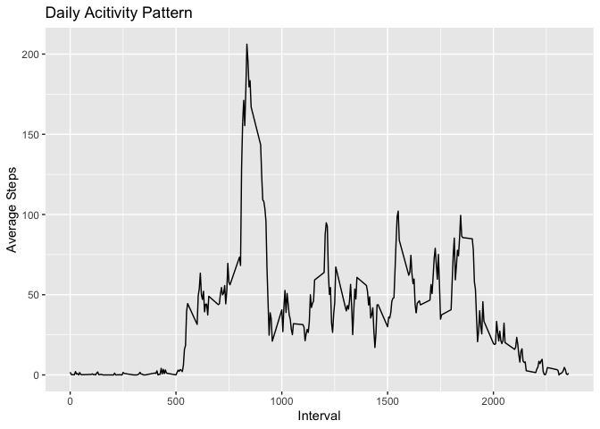
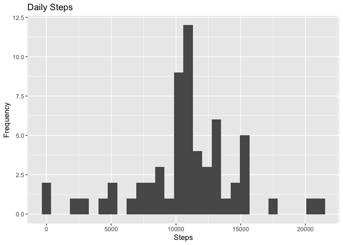
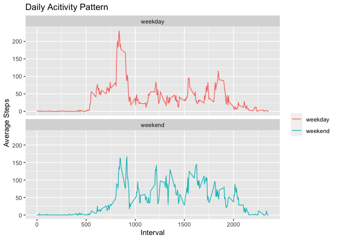

## Loading and preprocessing the data

Download dataset if necessary.

```r
data_url <- "https://d396qusza40orc.cloudfront.net/repdata%2Fdata%2Factivity.zip"
if (!file.exists("activity.csv")) {
        if (file.exists("activity.zip")) {
                download.file(url = data_url, destfile = "activity.zip", method = "curl")
        }
        unzip("activity.zip")
}
```
Load needed package and dataset.

```r
library(tidyverse)
```


```r
activity <- read_csv("activity.csv")
activity
```

```
## # A tibble: 17,568 x 3
##    steps date       interval
##    <dbl> <date>        <dbl>
##  1    NA 2012-10-01        0
##  2    NA 2012-10-01        5
##  3    NA 2012-10-01       10
##  4    NA 2012-10-01       15
##  5    NA 2012-10-01       20
##  6    NA 2012-10-01       25
##  7    NA 2012-10-01       30
##  8    NA 2012-10-01       35
##  9    NA 2012-10-01       40
## 10    NA 2012-10-01       45
## # … with 17,558 more rows
```


## What is mean total number of steps taken per day?

### Histogram of the total number of steps taken each day

```r
daily_steps <- activity %>%
        group_by(date) %>%
        summarise(total_steps = sum(steps))
daily_steps
```

```
## # A tibble: 61 x 2
##    date       total_steps
##    <date>           <dbl>
##  1 2012-10-01          NA
##  2 2012-10-02         126
##  3 2012-10-03       11352
##  4 2012-10-04       12116
##  5 2012-10-05       13294
##  6 2012-10-06       15420
##  7 2012-10-07       11015
##  8 2012-10-08          NA
##  9 2012-10-09       12811
## 10 2012-10-10        9900
## # … with 51 more rows
```

```r
ggplot(daily_steps, aes(total_steps)) +
        geom_histogram() + 
        labs(title = "Daily Steps", x = "Steps", y = "Frequency")
```

```
## Warning: Removed 8 rows containing non-finite values (stat_bin).
```

<!-- -->

### Mean and median number of steps taken each day

```r
mean(daily_steps$total_steps, na.rm = TRUE)
```

```
## [1] 10766.19
```

```r
median(daily_steps$total_steps, na.rm = TRUE)
```

```
## [1] 10765
```


## What is the average daily activity pattern?

```r
average_interval_steps <- activity %>%
        group_by(interval) %>%
        summarise(average_steps = mean(steps, na.rm = TRUE))

ggplot(average_interval_steps, aes(interval, average_steps)) + 
        geom_line() +
        labs(title = "Daily Acitivity Pattern", x = "Interval", y = "Average Steps")
```

<!-- -->

Find the interval which contain max average steps.

```r
average_interval_steps[which.max(average_interval_steps$average_steps),]
```

```
## # A tibble: 1 x 2
##   interval average_steps
##      <dbl>         <dbl>
## 1      835          206.
```


## Imputing missing values

### Calculate the total number of missing values in the dataset 

```r
table(is.na(activity$steps))
```

```
## 
## FALSE  TRUE 
## 15264  2304
```

### Strategy for filling in all of the missing values in the dataset
According to `daily_steps`, step data are missed in some whole days. We can simply fill the missing data in the with steps of `average_interval_steps`.


### Create a new dataset with missing data filled

```r
na_date <- filter(daily_steps, is.na(total_steps))[["date"]]
activity[is.na(activity$steps), "steps"] <- rep(average_interval_steps$average_steps, times = length(na_date))
```
Let's check NAs again

```r
table(is.na(activity$steps))
```

```
## 
## FALSE 
## 17568
```


### Histogram of the total number of steps taken each day

```r
daily_steps <- activity %>%
        group_by(date) %>%
        summarise(total_steps = sum(steps))
daily_steps
```

```
## # A tibble: 61 x 2
##    date       total_steps
##    <date>           <dbl>
##  1 2012-10-01      10766.
##  2 2012-10-02        126 
##  3 2012-10-03      11352 
##  4 2012-10-04      12116 
##  5 2012-10-05      13294 
##  6 2012-10-06      15420 
##  7 2012-10-07      11015 
##  8 2012-10-08      10766.
##  9 2012-10-09      12811 
## 10 2012-10-10       9900 
## # … with 51 more rows
```

```r
ggplot(daily_steps, aes(total_steps)) +
        geom_histogram() + 
        labs(title = "Daily Steps", x = "Steps", y = "Frequency")
```

<!-- -->


### Calculate the mean and median total number of steps taken per day

```r
mean(daily_steps$total_steps)
```

```
## [1] 10766.19
```

```r
median(daily_steps$total_steps)
```

```
## [1] 10766.19
```


## Are there differences in activity patterns between weekdays and weekends?
Create a new variable indicating each observation is a weekday or weekend and plot activity pattern.

```r
activity <- activity %>% 
        mutate(day_of_week = weekdays(date))

activity$day_of_week <- sub("Monday|Tuesday|Wednesday|Thursday|Friday", "weekday", activity$day_of_week)
activity$day_of_week <- sub("Saturday|Sunday", "weekend", activity$day_of_week)
```


```r
average_interval_steps <- activity %>%
        group_by(interval, day_of_week) %>%
        summarise(average_steps = mean(steps))
average_interval_steps
```

```
## # A tibble: 576 x 3
## # Groups:   interval [288]
##    interval day_of_week average_steps
##       <dbl> <chr>               <dbl>
##  1        0 weekday           2.25   
##  2        0 weekend           0.215  
##  3        5 weekday           0.445  
##  4        5 weekend           0.0425 
##  5       10 weekday           0.173  
##  6       10 weekend           0.0165 
##  7       15 weekday           0.198  
##  8       15 weekend           0.0189 
##  9       20 weekday           0.0990 
## 10       20 weekend           0.00943
## # … with 566 more rows
```

```r
ggplot(average_interval_steps, aes(interval, average_steps, color = day_of_week)) + 
        geom_line() +
        facet_wrap(.~ day_of_week, nrow = 2) +
        labs(title = "Daily Acitivity Pattern", x = "Interval", y = "Average Steps") +
        theme(legend.title=element_blank())
```

<!-- -->

