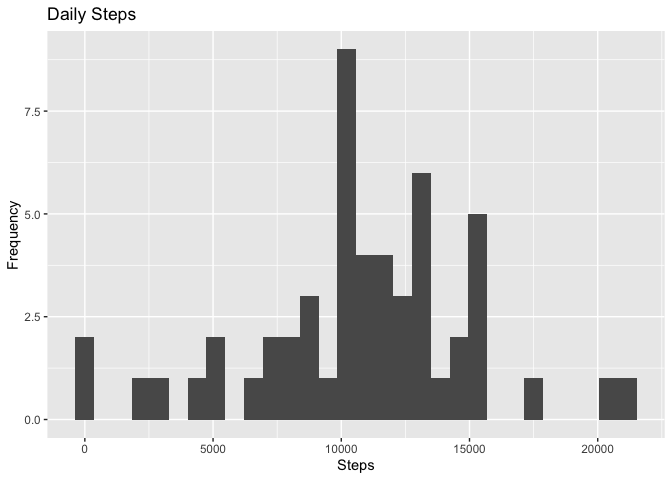
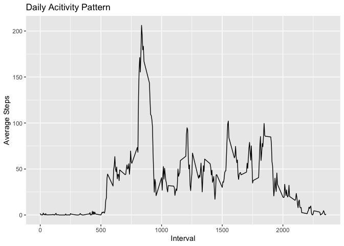

## Loading and preprocessing the data


```r
library(tidyverse)
```


```r
activity <- read_csv("activity.csv")
activity
```

```
## # A tibble: 17,568 x 3
##    steps date       interval
##    <dbl> <date>        <dbl>
##  1    NA 2012-10-01        0
##  2    NA 2012-10-01        5
##  3    NA 2012-10-01       10
##  4    NA 2012-10-01       15
##  5    NA 2012-10-01       20
##  6    NA 2012-10-01       25
##  7    NA 2012-10-01       30
##  8    NA 2012-10-01       35
##  9    NA 2012-10-01       40
## 10    NA 2012-10-01       45
## # … with 17,558 more rows
```


## What is mean total number of steps taken per day?

### Histogram of the total number of steps taken each day

```r
daily_steps <- activity %>%
        group_by(date) %>%
        summarise(total_steps = sum(steps))
daily_steps
```

```
## # A tibble: 61 x 2
##    date       total_steps
##    <date>           <dbl>
##  1 2012-10-01          NA
##  2 2012-10-02         126
##  3 2012-10-03       11352
##  4 2012-10-04       12116
##  5 2012-10-05       13294
##  6 2012-10-06       15420
##  7 2012-10-07       11015
##  8 2012-10-08          NA
##  9 2012-10-09       12811
## 10 2012-10-10        9900
## # … with 51 more rows
```

```r
ggplot(daily_steps, aes(total_steps)) +
        geom_histogram(binwidth = 1000) + 
        labs(title = "Daily Steps", x = "Steps", y = "Frequency")
```

```
## Warning: Removed 8 rows containing non-finite values (stat_bin).
```

<!-- -->

### Mean and median number of steps taken each day

```r
mean(daily_steps$total_steps, na.rm = TRUE)
```

```
## [1] 10766.19
```

```r
median(daily_steps$total_steps, na.rm = TRUE)
```

```
## [1] 10765
```


## What is the average daily activity pattern?

```r
average_interval_steps <- activity %>%
        group_by(interval) %>%
        summarise(average_steps = mean(steps, na.rm = TRUE))

ggplot(average_interval_steps, aes(interval, average_steps)) + 
        geom_line() +
        labs(title = "Daily Acitivity Pattern", x = "Interval", y = "Average Steps")
```

<!-- -->


```r
average_interval_steps[which.max(average_interval_steps$average_steps),]
```

```
## # A tibble: 1 x 2
##   interval average_steps
##      <dbl>         <dbl>
## 1      835          206.
```


## Imputing missing values


## Are there differences in activity patterns between weekdays and weekends?
